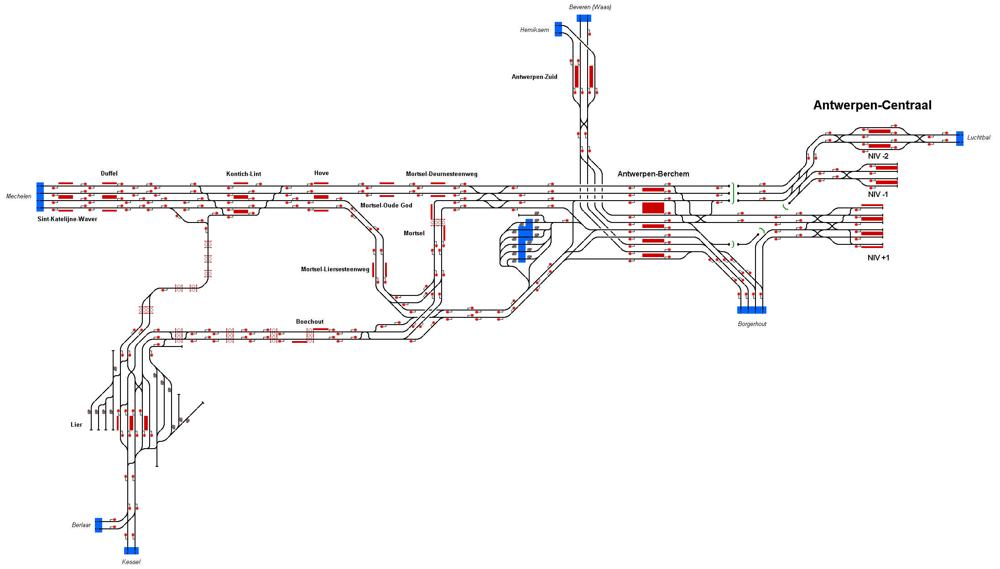

# Antwerpen Centraal
Simulation depicting the railway network south of Antwerp Central railway station in the city of Antwerp, Belgium.
The network is operated by the National Railway Company of Belgium (NMBS/SNCB). 

## Current Status

| Stage         | Status        |
| ------------- |:-------------:|
| Track Plan     |  |
| Signalling      |       |
| Naming |       |
| Speed Limits |  |
| Distances |  |
| Timetable |  |
| Documentation |  |

## Data Sources

- [Seinhuis Antw.-Berchem : Treinschema's by TreinTeLaat (Youtube)](https://www.youtube.com/watch?v=DWOSN8neHZw)
- [Pov Brussel-Midi/zuid to Antwerp Central by train part 2 by Jen (Youtube)](https://www.youtube.com/watch?v=DrwFetQ8PVw&t=808s)
- [Seinhuis Antwerpen-Berchem by Spoorpunt.nl (Flickr)](https://www.flickr.com/photos/spoorpunt/8079995406)
- [SNCB/NMBS Timetable Leaflets](https://www.belgiantrain.be/en/travel-info/prepare-for-your-journey/leaflets)

Status icons by Freepik, pixelmeetup, Pixel Perfect on FlatIcon.com.
